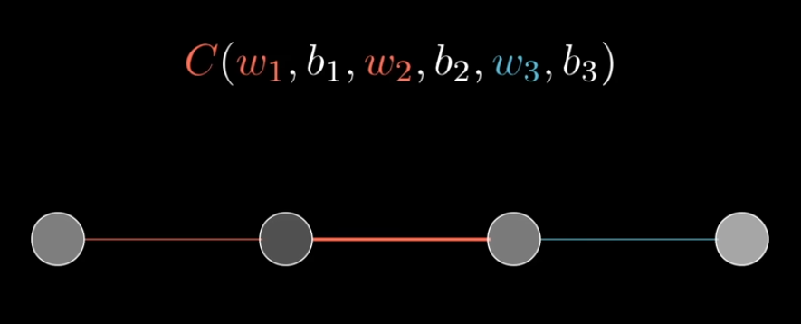
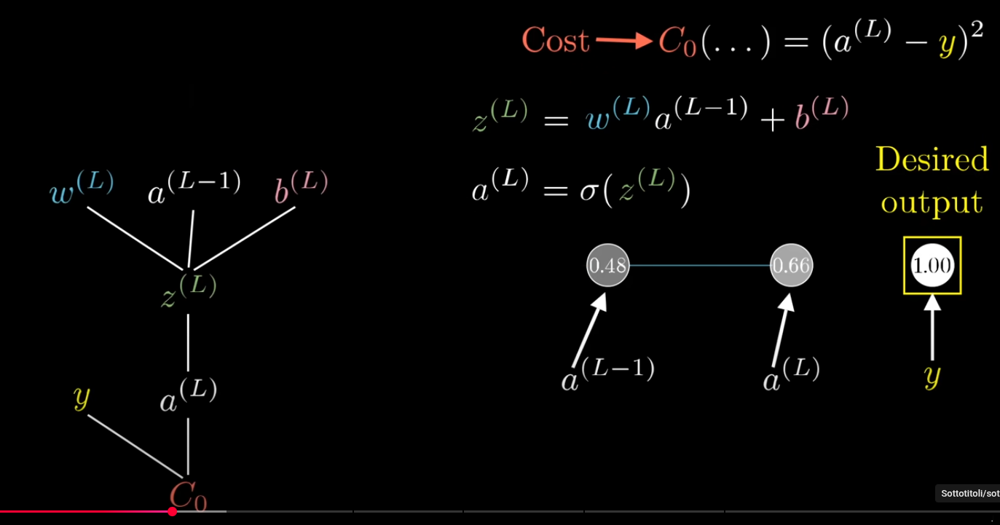
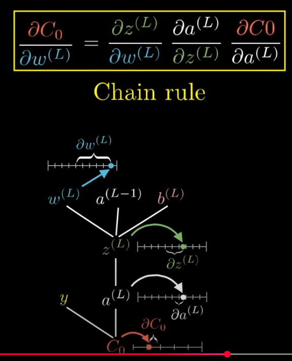
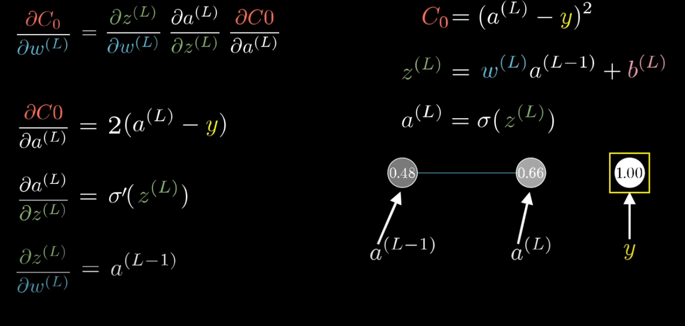
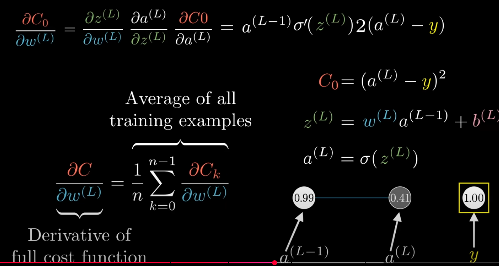
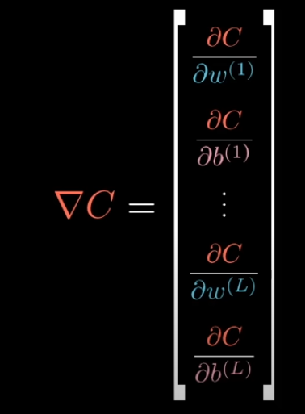
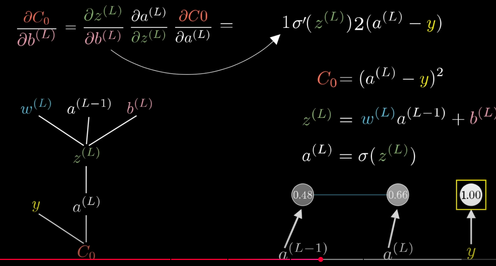
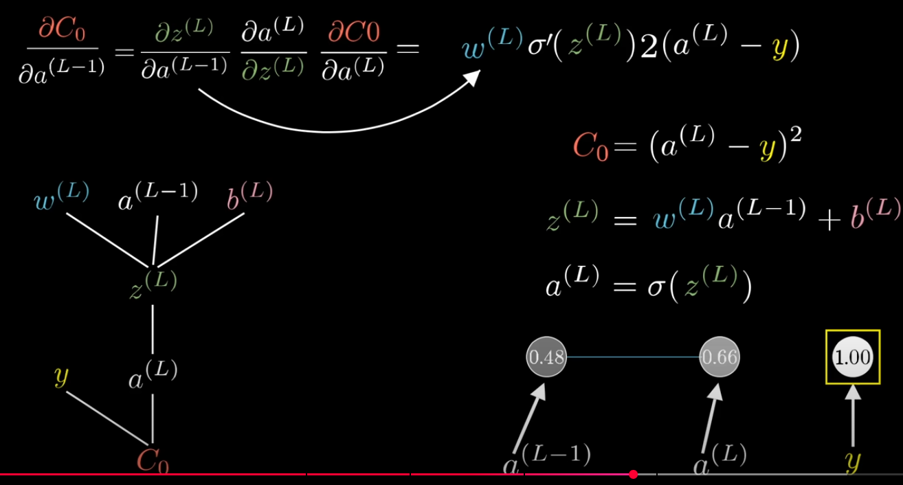
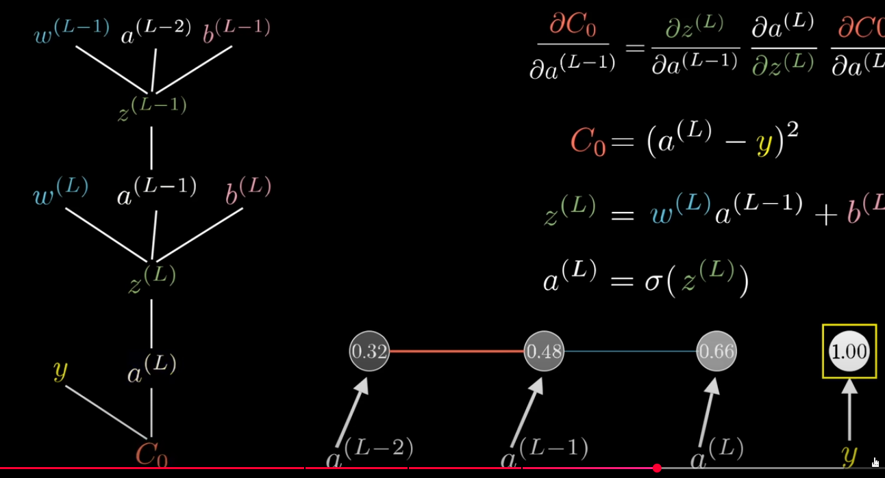

## Caso semplificato
Partiamo con un esempio semplice: una rete con 4 livelli con un singolo neurono ciascuno, 3 pesi e 3 bias.

Il nostro **obiettivo** è capire quanto è sensibile la funzione di errore rispetto a variazioni di ognuna di queste variabili (gradiente)
- in questo modo possiamo capire quali sono le correzioni più efficenti ai pesi e bias; ovvero, le correzioni che fanno decrescere l'errore più rapidamente (discesa del gradiente)

**Concentriamoci sulla connesione tra gli ultimi due neuroni**

### Notazione: 
- chiamiamo _a^(L)_ l'attivazione dell'ultimo neurone
    - L indica il livello in considerazione, in questo caso L = ultimo livello della rete
- chiamiamo _y_ il valore di attivazione desiderato **per un dato training example**
- l'errore della rete per un singolo esempio di training è quindi dato da: C_0 = (a^(L) - y)^2
    - C_0 sta ad indicare il costo dell'esempio 0
- l'attivazione a^(L) è determinata da:
    - un singolo peso (singolo in questa rete semplice) w^(L)
    - moltiplicato per l'attivazione del neurone del layer precedente a^(L-1)
    - sommato al bias b^(L)
    - chiamiamo questa somma pesata z^(L) = w^(L)*a^(L-1) + b^(L)
    - il tutto dato in paso ad una funzione di attivazione sigma
    - a^(L) = sigma( z^(L) )

Riassumendo abbiamo:
- il peso e il bias del livello L insieme all'attivazione L-1 forniscono la somma pesata del livello L
- dalla somma pesata otteniamo l'attivazione
- dall'attivazione ottenuta e dall'attivazione desiderata otteniamo il costo dell'esempio

(Abbiamo poi che a^(L-1) dipende poi dai suoi pesi e bias ecc... ma per adesso lasciamo stare)

### studio delle variazioni
w^(L), z^(L), a^(L) e C_0 sono dei semplici valori scalari, possiamo rappresentarli su una linea.

Il nostro primo obiettivo è capire come varia l'errore C0 al variare del peso w^(L). In altri termini, **ci interessa la derivata di C0 rispetto a w^(L)**
- siccome abbiamo altri due input: a^(L-1) e b^(L), successivamente, ci interesseranno anche le derivate rispetto a questi due termini
- nota che peso e bias possiamo variarli direttamente mentre l'attivazione precedente no
    - idea di backpropagation, vedi dopo

**appendice derivate**
pensa ai differenziali all'interno di una derivata come a:
- minuscole variazioni del termine se al denominatore
    - ad esempio: delta w^(L) = w^(L) +- 0.000001
- le corrispettive variazioni del termine se al numeratore
    - ad esempio delta C0 = |C0 - C(w^(L)+0.000001)|

La derivata ci dice come varia (tanto/poco) il termine a numeratore al variare del termine a denominatore; ovvero, il rapporto tra i due differenziali

**chain-rule**
Notiamo che possiamo scomporre la derivata dato che
- una piccola variazione di w^(L) causa una piccola variazione a z^(L)
- che a sua volta causa una piccola variazione ad a^(L)
- che infine causa una piccola variazione a C0

Otteniamo quindi che la derivata originale si traduce in una serie (catena) di prodotti di derivate più semplici. Osserva l'immagine sotto.

**calcolo derivate**

osserviamo che:
- la derivata del costo rispetto all'attivazione **è proporzionale all'errore rispetto tra attivazione ottenuta e attivazione desiderata**
    - se l'errore fosse grande, anche piccole variazioni dell'attivazione avrebbero effetti significati sul costo finale
    - intuitivamente ha senso, se sono già più o meno attivo quanto serve variare non ha molto senso
- la derivata della somma pesata (~attivazione) rispetto al peso è **proporzionale all'attivazione del livello precedente**
    - questo è in linea con quanto osservato intuitivamente nell'altro file
        - **è più importante aggiustare i pesi corrispondenti ad attivazioni precedenti grandi in magnitudo**
        - se il neurone precedente è molto attivo variare anche di poco il peso produce effetti significativi nell'attivazione del neurone corrente

**visione d'insieme**
La derivata finale ottenuta fa riferimento ad un **singolo esempio di training**. Per ottenere la derivata della funzione di errore generale bisogna ripetere gli stessi passaggi e fare la media degli errori ottenuti. 

Fino ad adesso abbiamo poi solo considerato l'ultimo peso w^(L), ma questo è solo uno tra i vari possibli parametri della rete. **Abbiamo calcolato solo un componente del vettore gradiente**

Dobbiamo calcolare anche il resto del vettore facendo le derivate parziali anche per gli altri pesi e bias (facendo la media di tutti gli esempi)

Ma come facciamo? Non è immediato capire la formula...

**consideriamo gli altri input**
Abbiamo visto come varia il costo al variare dell'ultimo peso w^(L). Abbiamo però altri due input: b^(L) e a^(L-1). Consideriamo come varia il costo anche rispetto a questi altri due input.

La derivata parziale rispetto all'ultimo bias è molto simile rispetto a quella dell'ultimo peso

La derivata rispetto all'attivazione precedente corrisponde al peso corrente
- anche questo è in linea con quanto osservato nel file precedente
    - **hanno più peso le correzioni delle attivazioni precedenti corrispondenti a pesi correnti grandi in valore assoluto**

**Nota bene**: questo è il caso ricorsivo della backpropagation!

**NB**: non possiamo variare direttamente l'attivazione del livello precedente!
- tuttavia **possiamo riapplicare la stessa procedimento della chain rule (osserva grafo) all'indietro (backpropagation)** per capire come varia la funzione di errore al variare dei pesi e bias precedenti!

## Generalizzazione a layer con più neuroni

### Notazione