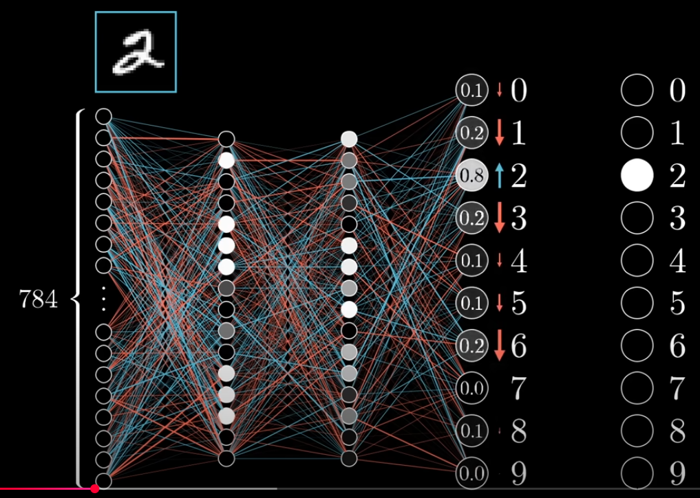
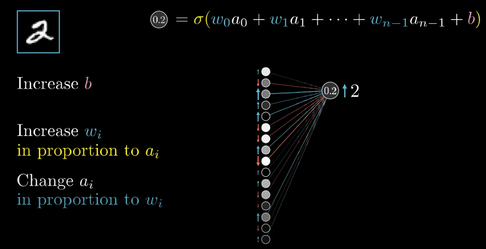

### Funzione di errore
L'errore di un singolo esempio è dato dalla differenza tra vettore delle uscite desiderate, con il vettore dell'uscita corrente della rete con l'esempio fornito in ingresso

L'errore totale della rete è ottenuto sommando i singoli errori di ogni esempio nel training set, e facendo la media aritmentica di questa somma
- in questo modo si riesce a calcolare una stima di quanto la rete sia lontana dal produrre il risultato desiderato considerando tutte i possibili input, e non solo un particolare esempio

L'errore della rete (sia singolo che totale) è una funzione di tutti i pesi e bias
- L'attivazione dell'ultimo livello di uscita dipende dai pesi e bias di quel livello, e dalle attivazioni del livello precedente
- Ma le attivazioni del livello precedente dipendono dai propri pesi e bias, e dalle attivazioni del livello precedente ancora
- ...
- Insomma, la funzione di errore si ottiene espandendo le attivazioni di tutti i livelli fino ad arrivare al livello di input

### Discesa del gradiente
Facendo la discesa del gradiente di questa funzione di errore, otteniamo un vettore (l'opposto del gradiente) che ci dice come modificare questi pesi e bias per ottenere la diminuzione dell'errore più efficente e rapida.
- la riduzione dell'errore tramite discesa del gradiente è come la rete "apprende"

è utile pensare al gradiente non come ad una direzione in una spazio n-dimensionale, ma piuttosto, come ad una misura di quali sono i pesi che impattano di più nel diminuire l'errore. 

In altri termini, il valore assoluto di ogni componente del gradiente ci dice quanto la funzione di errore è sensibile rispetto alle variazioni di ogni singolo peso e bias (vettore delle derivate parziali)    
- se una componente ha valore assoluto alto, piccole variazioni di quel peso/bias produrranno grandi variazioni dell'errore
- se una componente ha valore assolto basso, grandi variazioni di quel peso/bias produrranno modeste variazioni dell'errore
- **derivata parziale alta === velocità di variazione alta** e viceversa

### Backpropagation
questo è un algoritmo che permette di computare il gradiente citato sopra (passo durante la discesa).

Partiamo considerando un singolo esempio: un 2. Che effetto dovrebbe avere questo 2 sui pesi e bias della rete?

1. Concentriamoci inizalmente sul livello di output: **la variazione delle attivazioni dell'ultimo livello dovrebbe essere proporziale a quanto questi valori si discostano dal loro valore obiettivo**
    - se un attivazione è vicina al suo obiettivo va variata di poco; va variata invece di tanto altrimenti
    - es. Incrementare l'attivazione del neurone 2 è più importante rispetto a diminuire l'attivazione del neurone 8

2. Concetriamoci adesso su un singolo neurone del livello di output. Da che cosa dipende la sua attivazione? Come facciamo a incrementarla/decrementarla?
    - L'attivazione di un neurone dipende da una somma pesata di tutte le attivazioni del livello precedente, sommato a un bias, il tutto dato in pasto ad una funzione attivazione (sigmoid, ReLU, ...)
    - Abbiamo quindi tre opzioni per aumentare/diminuire l'attivazione del nostro neurone in uscita
        - incrementare i pesi del neurone in uscita
            - in questo caso notiamo che i pesi hanno capacità diverse variare l'attivazione del neurone di uscita
            - **i pesi corrispondenti ad attivazioni del livello precedente grandi in valore assoluto hanno un'influenza maggiore** rispetto a quelli relativi ad attivazioni più piccole
        - incrementare il bias del neurone in uscita
        - modificare le attivazioni del livello precedente
            - se le attivazioni del livello precedente che hanno un peso positivo vengono incrementate e/o quello che hanno un peso negativo vengono diminuite, allora l'attivazione del neurone in uscita sale
            - similmente al variare i pesi, **otteniamo un incremento maggiore dell'attivazione del neurone in uscita se facciamo variare le attivazioni del livello precedente corrispondenti a pesi grandi in valore assoluto** 
            - **attenzione**: non possiamo modificare direttamente le attivazioni del livello precedente, possiamo solo modificare i pesi e i bias della rete.

3. Quanto detto fino ad ora considera solo un singolo neurone del livello di output. Ogni altro neurone del livello di output ha i propri desideri riguardanti le variazioni dei pesi, bias e attivazioni del livello precedente che producono la variazione desiderata nella propria attivazione
    - i desideri (variazioni dei pesi, bias e attivazioni precedenti) di tutti i neuroni del livello di output vengono sommate insieme per produrre il **vettore di variazioni finali desiderate dal penultimo livello** (simile a punto 1 ma per un livello nascosto)
    - una volta ottenuto il vettore di variazioni finali desiderate dal penultimo livello, possiamo **riapplicare ricorsivamente lo stesso procedimento** per ottenere il vettore di variazioni finali del livello prima ancora 
    - è in questo senso che l'algoritmo **propaga all'indietro**, si parte dalle variazioni desiderate dall'ultimo livello e mano a mano di ottengono le variazioni desiderata dai livelli precedenti